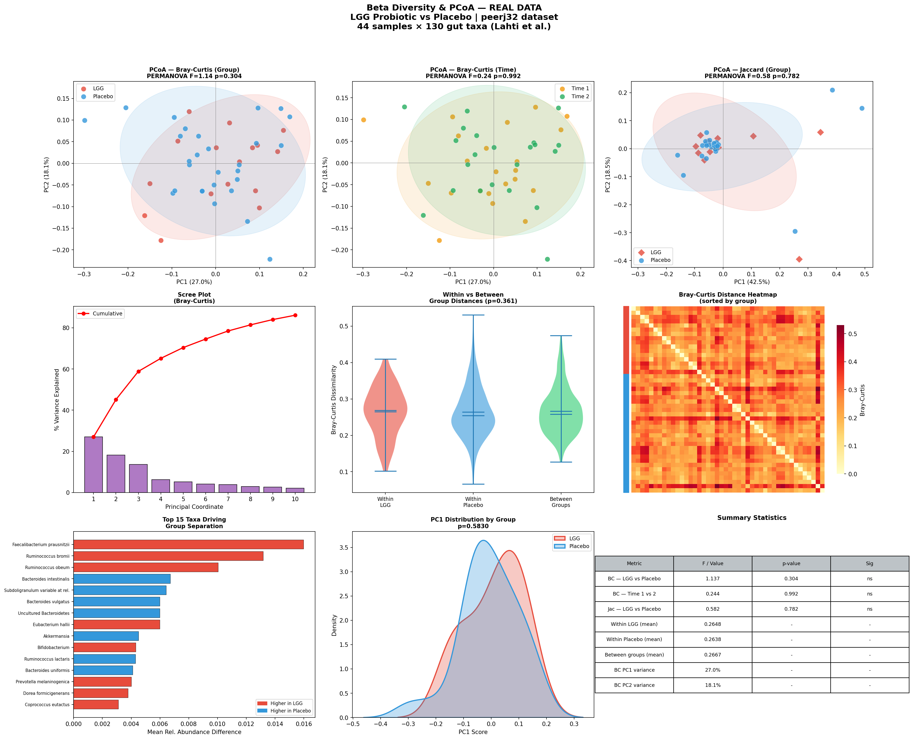

# Day 02 — Beta Diversity & PCoA Visualization
### 🧬 30 Days of Bioinformatics | Subhadip Jana


> Beta diversity analysis comparing gut microbiome **composition** between LGG probiotic vs Placebo using Bray-Curtis, Jaccard, PCoA and PERMANOVA.

---

## 📊 Dashboard


---

## 🔬 Dataset — peerj32
| Feature | Value |
|---------|-------|
| Samples | 44 |
| Taxa | 130 gut bacteria |
| Groups | LGG probiotic (16) vs Placebo (28) |
| Source | microbiome R package (Lahti et al.) |

---

## 📈 Methods
| Method | Purpose |
|--------|---------|
| **Bray-Curtis Dissimilarity** | Quantify compositional difference |
| **Jaccard Distance** | Presence/absence dissimilarity |
| **PCoA** | 2D ordination of sample similarity |
| **PERMANOVA** | Statistical test for group separation |
| **Within vs Between distances** | Group dispersion analysis |

---

## 📊 Key Results

| Test | F-stat | p-value |
|------|--------|---------|
| BC — LGG vs Placebo | 1.137 | 0.304 (ns) |
| BC — Time 1 vs 2 | 0.244 | 0.992 (ns) |
| Jac — LGG vs Placebo | 0.582 | 0.782 (ns) |

**Finding:** No significant compositional difference between LGG and Placebo groups (PERMANOVA p>0.05). PC1 explains 27% variance. Within-group distances are comparable (LGG=0.265, Placebo=0.264), indicating similar microbiome variability in both groups.

**Biological interpretation:** LGG probiotic supplementation did not significantly restructure overall gut microbiome composition — consistent with alpha diversity findings from Day 01.

---

## 🚀 How to Run
```bash
pip install pandas numpy matplotlib seaborn scipy
python beta_diversity.py
```

---

## 📁 Structure
```
day02-beta-diversity/
├── beta_diversity.py
├── data/
│   ├── otu_table.csv
│   └── metadata.csv
├── outputs/
│   ├── bray_curtis_matrix.csv
│   ├── pcoa_braycurtis.csv
│   ├── pcoa_jaccard.csv
│   └── beta_diversity_dashboard.png
└── README.md
```

---

## 🔗 Part of #30DaysOfBioinformatics
**Author:** Subhadip Jana | [GitHub](https://github.com/SubhadipJana1409) | [LinkedIn](https://linkedin.com/in/subhadip-jana1409)
